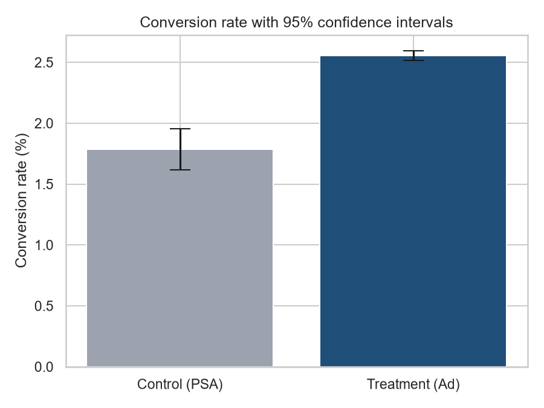
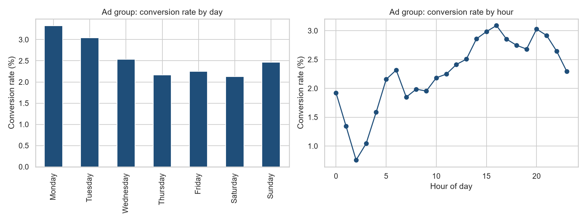

# Marketing A/B Test Analysis

Did showing product ads convert better than showing a public service announcement?
An A/B test analysis of **588,101 users** using **Python and SQL**.

## Experiment

| Group | What users saw | Users |
|---|---|---|
| Control | Public service announcement (PSA) | 23,524 (4%) |
| Treatment | Product ad | 564,577 (96%) |

- **Metric:** conversion rate (user bought the product).
- **Null hypothesis:** the conversion rate is the same in both groups.
- **Checks before testing:** no duplicate users, no missing values, both groups saw the same average number of impressions (24.8).

## Result

| | Control (PSA) | Treatment (Ad) |
|---|---|---|
| Conversion rate | 1.785% | 2.555% |

- **Absolute lift:** 0.77 percentage points (95% CI: 0.60 to 0.94).
- **Relative lift:** 43.1%.
- **Two-proportion z-test:** z = 7.37, p < 0.001. **Chi-square test:** chi2 = 54.0, p < 0.001.
- The null hypothesis is rejected at alpha = 0.05: the ads increased conversion.
- The test was well powered: about 5,600 users per group were needed for 80% power at this lift, and the smaller group had 23,524.



## Segment findings (ad group)

- **Day of week:** conversion is highest on Monday (3.32%) and Tuesday (3.04%), lowest on Saturday (2.13%).
- **Ad exposure:** conversion rises sharply with exposure, from 0.33% for users who saw 1-10 ads to 17.1% for users who saw more than 100.
  This is a correlation, not a causal effect: users who browse more see more ads and are also more likely to buy.



## Recommendations

1. Roll out the ad campaign: the lift is statistically significant and practically large.
2. Shift ad budget towards Monday and Tuesday.
3. Run a follow-up experiment that randomises ad frequency to measure the causal effect of exposure.

## Tools and techniques

| Area | What was done |
|---|---|
| **Python** | Pandas, NumPy, SciPy, Matplotlib, Seaborn |
| **Statistics** | Two-proportion z-test, chi-square test, confidence intervals, statistical power and sample-size calculation |
| **SQL** (SQLite) | Aggregations, CASE buckets, CTE, RANK and share-of-total window functions |

## How to run

1. Download [Marketing A/B Testing](https://www.kaggle.com/datasets/faviovaz/marketing-ab-testing) from Kaggle and put `marketing_AB.csv` in `data/`.
2. Run:

```powershell
pip install pandas numpy scipy matplotlib seaborn
python analysis.py
```

Results are written to `outputs/` (summary, SQL results and charts).
